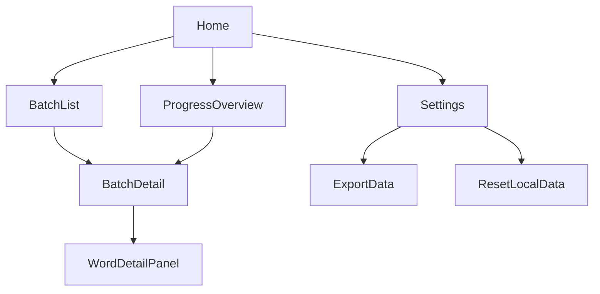

# 词表驱动型信息架构与页面原型

## 1. 信息架构（页面关系图）

## 2. 页面与模块说明
### 2.1 首页（Home）
- 核心入口：批次列表卡片入口（跳转到批次列表）
- 概览模块：总进度、最近学习批次、最近备注
- 快捷入口：继续上次批次（记住 lastVisited）

### 2.2 批次列表（BatchList）
- 批次卡片列表：第 1–12 批
- 每卡片展示：批次范围、词数、已掌握数、完成率
- 排序：默认 1 → 12

### 2.3 批次详情（BatchDetail）
- 顶部：批次信息（标题、范围、完成率）
- 列表区：词表列表
  - 列表项：单词 + 掌握状态 + 备注标识
  - 筛选：全部 / 未掌握 / 已掌握 / 有备注
- 详情区（侧栏或抽屉）：单词详情
  - 单词、批次信息、掌握开关、备注编辑

### 2.4 进度概览（ProgressOverview）
- 总体进度条
- 批次进度列表（可点击进入批次详情）
- 最近学习记录（最近标记/备注的词）

### 2.5 设置（Settings）
- 数据管理：清空本地进度与备注
- 导出（预留）：TXT / Markdown / CSV

## 3. 核心流程与交互要点
### 3.1 浏览与进入批次
- 用户进入首页 → 点击“批次列表” → 进入批次详情
- 进入批次详情时，默认展示“全部”筛选

### 3.2 标记掌握
- 在词表列表中点击掌握按钮即可切换状态
- 进度条与批次完成率即时更新
- 该状态在本地存储持久化

### 3.3 备注记录
- 点击单词打开详情区
- 备注支持即时保存（失焦或键入即保存）
- 备注存在时，列表项显示标识并可筛选
